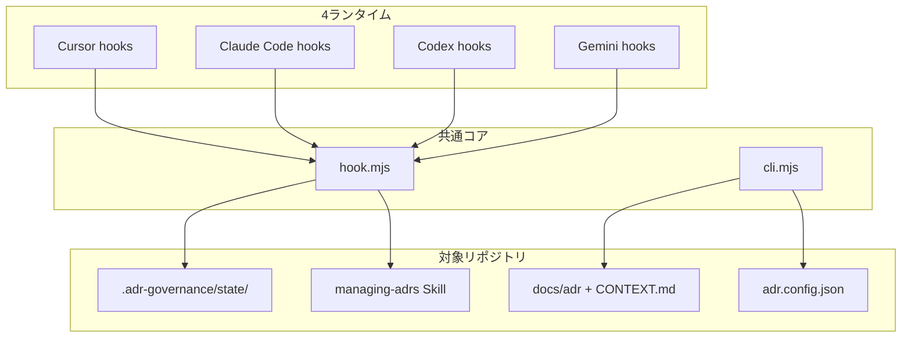

# adr-governance

[English](./README.md) | 日本語

[](./LICENSE)
[](./package.json)

コーディングエージェント向けのマルチランタイム ADR ガバナンス — 共通 Skill (`managing-adrs`)、同梱 CLI、**Cursor** / **Claude Code** / **Codex CLI** / **Gemini CLI** 向け hook を提供します。

## オープンソース

本プロジェクトは **MIT ライセンス** で、オープンソース配布（npm パッケージ、スタンドアロン clone、将来の public GitHub）を想定した構成です。

GitHub リポジトリは現在 **private** です。ソースへのアクセスには organization メンバーシップ、または maintainer からの明示的な grant が必要です。[CONTRIBUTING.md](./CONTRIBUTING.md) と [SECURITY.md](./SECURITY.md) を参照してください。

- **Repository:** https://github.com/guilz-dev/adr-governance
- **License:** [MIT](./LICENSE)
- **Changelog:** [CHANGELOG.md](./CHANGELOG.md)
- **Design spec:** [docs/specs/adr-governance-design.md](./docs/specs/adr-governance-design.md)
- **Implementation status:** [docs/IMPLEMENTATION-STATUS.md](./docs/IMPLEMENTATION-STATUS.md)

## 仕組み

**adr-governance** は、コーディングエージェント（Cursor / Claude Code / Codex CLI / Gemini CLI）が設計判断をコードに書き込んでも **「なぜそうしたか」が残らない** 問題を防ぐための共通基盤です。Skill・CLI・Hook を1パッケージにまとめ、4ランタイムで同じ判断基準と文書ライフサイクルを使います。

### 何を解決するか

| 成果物 | 役割 |
|--------|------|
| **ADR** (`docs/adr/`, `docs/proposed-adr/`) | 何を決め、なぜそうしたか |
| **CONTEXT** (`CONTEXT.md`) | ドメイン用語の意味 |
| **Skill** (`.agents/skills/managing-adrs/`) | エージェントへの判断手順 |
| **CLI** (`.adr-governance/bin/cli.mjs`) | 作成・検証・同期 |
| **Hook** (`.adr-governance/bin/hook.mjs`) | 毎ターンの監査 |

逆に、軽微な変更のたびに ADR を増やさないよう、**3条件**（[原則](#原則) 参照）で絞り込みます。

### 全体像



各ランタイムの shim（例: `.cursor/hooks/adr-governance.mjs`）は薄いラッパーで、実処理はすべて `.adr-governance/bin/hook.mjs` に集約されます。**判断ロジックを4箇所に複製しない** のが設計の核心です。

### 導入の流れ (`init`)

1. **スキャンのみ** — 既存 ADR / CONTEXT / エージェント設定を解析し、OS 一時ディレクトリに `init-plan.json` を出力（**この時点ではリポジトリは変更しない**）
2. **人間が plan をレビュー**
3. **`init --apply`** — Skill、hook bundle、`adr.config.json`、各ランタイムの hook エントリを **merge** して配置

### 1ターンのライフサイクル

#### before-turn（プロンプト送信前）

Cursor では `beforeSubmitPrompt`、Claude Code では `UserPromptSubmit` など、各ランタイムの before hook から共通処理を呼びます。

1. プロンプト本文は**保存しない**（SHA-256 のみ）
2. キーワード（architecture, auth, migration 等）から `risk = none | possible | likely` を判定
3. 関連 ADR を最大5件マッチ
4. `risk` が elevated なら Skill 読み込み指示をエージェントへ注入
5. `.adr-governance/state/turns/<turnId>.json` にターン状態を記録

#### エージェント作業中

- `risk` が `possible` / `likely` → `managing-adrs` Skill に従い ADR/CONTEXT を更新するか判断
- 新 ADR は **3条件すべて** を満たす場合のみ:
  1. **Hard to reverse** — 後から変えるコストが大きい
  2. **Surprising without context** — 理由なしだと将来の読者が誤る
  3. **Real trade-off** — 現実的な代替案があった

#### after-turn（ターン終了時）

Cursor では `stop` hook などから after-turn を呼びます。

| 状況 | 動作 |
|------|------|
| ADR/CONTEXT が更新された | OK（監査解決） |
| エージェントが `turn-close` を実行 | OK（receipt 記録） |
| リスクあり & 更新なし | 最大1回フォローアップを注入（`maxFollowUps` で設定） |
| フォローアップ上限超過 | **silent close**（`reversible` 等の理由を自動記録） |
| リスクなし | そのまま終了 |

**Hook は fail-open** — 壊れてもエージェントは止まりません。  
**CI の `check` は fail-closed** — 文書の整合性は機械的に弾きます。

### CLI と CI

`check` が見るもの:

- ADR の frontmatter / status / Open Points
- 採番の重複（`--base origin/main` でブランチ間衝突も検出）
- CONTEXT のリンク切れ
- `manifest.json` との **drift**（生成物が手編集されていないか）
- hook エントリの欠落

対象リポジトリでは `.github/workflows/adr-governance.yml` を生成し、PR/push 時に `check --base origin/main` を走らせます。

### 設計上の重要な原則

1. **プロンプト/会話全文は永続化しない** — ハッシュとメタデータのみ
2. **コードから設計理由を捏造しない** — init 時も「観測事実」と「確認済み理由」を分ける
3. **accepted ADR は supersede で更新** — 結論変更は新 ADR + 旧 ADR を superseded
4. **Hook identity** — Cursor は `conversation_id` / `generation_id`、他は `session_id`。取れない場合は `transcript_path` のハッシュ、それも無ければ repo 全体スコープ（並列セッション非分離）

詳細は [docs/specs/adr-governance-design.md](./docs/specs/adr-governance-design.md) を参照してください。

## クイックスタート（対象プロジェクト）

```bash
# 1. 読み取り専用スキャン（plan + evidence を OS 一時ディレクトリにのみ出力）
node /path/to/adr-governance/dist/bundle/cli.mjs init --repo /path/to/your-repo

# 2. $TMPDIR/adr-governance-init/<hash>/init-plan.json をレビュー

# 3. 承認後に apply
node /path/to/adr-governance/dist/bundle/cli.mjs init \
  --apply /path/to/init-plan.json \
  --repo /path/to/your-repo
```

対象リポジトリ内の **インストール済み** CLI（`.adr-governance/bin/cli.mjs`）を使う場合、apply と sync にはパッケージソースを渡します:

```bash
node .adr-governance/bin/cli.mjs init --apply /path/to/init-plan.json \
  --from /path/to/adr-governance --repo .
node .adr-governance/bin/cli.mjs sync --from /path/to/adr-governance --repo .
```

apply 後、対象リポジトリには次が含まれます:

- `.agents/skills/managing-adrs/` — Skill の正本コピー
- `.adr-governance/bin/cli.mjs` + `hook.mjs` — 自己完結型 bundle
- `adr.config.json` — レイアウト、hook、検出時の `legacyFrontmatter`
- ランタイム shim + `.cursor/hooks.json` 等への **merge** 済み hook エントリ

Cursor が project hook の信頼を求めたら、`adr-governance` hook を承認してください。

## 開発

```bash
pnpm install
pnpm build
pnpm test
```

## CLI（init 後の対象リポジトリ内）

```bash
node .adr-governance/bin/cli.mjs check [--base origin/main]
node .adr-governance/bin/cli.mjs create --status proposed --title "..." --body-file body.md
node .adr-governance/bin/cli.mjs promote ADR-0007 [--approval human]
node .adr-governance/bin/cli.mjs supersede ADR-0002 --by ADR-0008
node .adr-governance/bin/cli.mjs sync --from /path/to/adr-governance
node .adr-governance/bin/cli.mjs turn-close --outcome no-change --reason reversible --session-id '<hookが提示したID>'
```

## 原則

1. **3条件**（すべて必須）: hard to reverse、surprising without context、real trade-off
2. **ADR** = 何を・なぜ; **CONTEXT** = ドメイン言語
3. 既定は **split layout**: `docs/adr/` + `docs/proposed-adr/`
4. Hook は **fail-open**; CI の `check` は **fail-closed**
5. プロンプト/トランスクリプト本文は永続化しない（SHA-256 のみ）

## ランタイム hook の identity

Claude Code、Codex CLI、Gemini CLI の hook payload は `session_id` を安定した会話スコープとして使います。Cursor は `conversation_id` と per-generation の `generation_id` を提供することがあります。adr-governance は audit chain に conversation id、turn pointer に generation id を優先します。

ランタイム id が無い場合、`transcript_path` をハッシュして会話スコープとします。安定した identity が一切取れない場合は、リポジトリ全体の pending audit スコープにフォールバックし warning を出します。この劣化モードでは並列セッションは分離されません。

## コントリビューション

[CONTRIBUTING.md](./CONTRIBUTING.md) を参照してください。参加前に [CODE_OF_CONDUCT.md](./CODE_OF_CONDUCT.md) をお読みください。

## セキュリティ

脆弱性報告は [SECURITY.md](./SECURITY.md) を参照してください。

## ライセンス

MIT © [guilz-dev](./LICENSE)

### 2026-09-13 調査に基づく信頼性修正

`check --base` はbase側の設定とmanifestで判定し、CIもbase側のCLIを実行します。更新後は再attestし、既存workflowに `edited` とbase側CLIの実行手順を反映してください。設定ファイルの正当な編集はsyncで保持されます。全指摘の対応状況と導入手順は[修正・移行ノート](docs/reliability-fixes-2026-09-13.md)を参照してください。v1証跡のv0.2.x互換期間は維持します。
