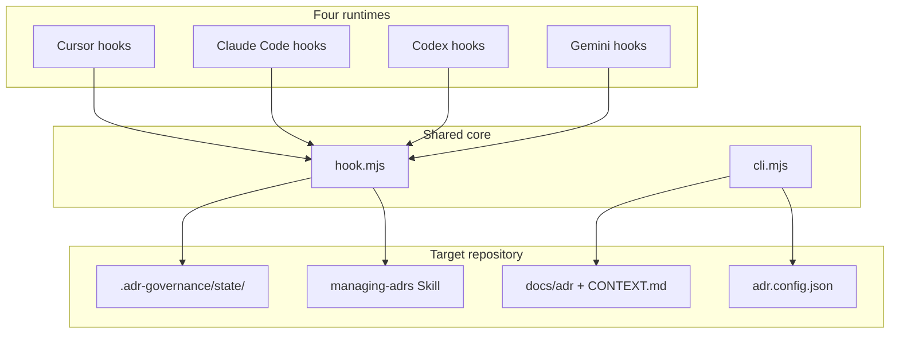

# adr-governance

English | [日本語](./README.ja.md)

[](./LICENSE)
[](./package.json)

Multi-runtime ADR governance for coding agents — shared Skill (`managing-adrs`), bundled CLI, and hooks for **Cursor**, **Claude Code**, **Codex CLI**, and **Gemini CLI**.

## Open source

This project is **MIT licensed** and structured for open-source distribution (npm package, standalone clone, or future public GitHub).

The GitHub repository is currently **private**. Source access requires organization membership or an explicit grant from maintainers. See [CONTRIBUTING.md](./CONTRIBUTING.md) and [SECURITY.md](./SECURITY.md).

- **Repository:** https://github.com/guilz-dev/adr-governance
- **License:** [MIT](./LICENSE)
- **Changelog:** [CHANGELOG.md](./CHANGELOG.md)
- **Design spec:** [docs/specs/adr-governance-design.md](./docs/specs/adr-governance-design.md)
- **Implementation status:** [docs/IMPLEMENTATION-STATUS.md](./docs/IMPLEMENTATION-STATUS.md)

## How it works

**adr-governance** keeps the *why* behind design decisions when coding agents (Cursor, Claude Code, Codex CLI, Gemini CLI) write code. It bundles Skill, CLI, and hooks into one package so all four runtimes share the same decision criteria and document lifecycle.

### What it solves

| Artifact | Role |
|----------|------|
| **ADR** (`docs/adr/`, `docs/proposed-adr/`) | What was decided and why |
| **CONTEXT** (`CONTEXT.md`) | Domain term meanings |
| **Skill** (`.agents/skills/managing-adrs/`) | Agent workflow for decisions |
| **CLI** (`.adr-governance/bin/cli.mjs`) | Create, validate, sync |
| **Hook** (`.adr-governance/bin/hook.mjs`) | Per-turn audit |

It also avoids ADR sprawl: the **three criteria** identify record candidates, but **explicit human intent** is required before authoring (see [Principles](#principles) below).

### Architecture



Each runtime shim (e.g. `.cursor/hooks/adr-governance.mjs`) is a thin wrapper. All logic lives in `.adr-governance/bin/hook.mjs` — **no duplicated decision logic across four runtimes**.

### Adoption flow (`init`)

1. **Scan only** — analyze existing ADRs, CONTEXT, and agent config; write `init-plan.json` to an OS temp directory (**no changes to the target repo yet**)
2. **Human reviews the plan**
3. **`init --apply`** — merge Skill, hook bundles, `adr.config.json`, and runtime hook entries into the target repo

### Per-turn lifecycle

#### before-turn (before prompt submission)

Each runtime's before hook (e.g. Cursor `beforeSubmitPrompt`, Claude Code `UserPromptSubmit`) calls shared logic:

1. **Do not store** prompt text (SHA-256 hash only)
2. Score keywords (architecture, auth, migration, etc.) → `risk = none | possible | likely`
3. Match up to 5 relevant ADRs by title
4. If `risk` is elevated, inject instructions to read the Skill
5. Write turn state to `.adr-governance/state/turns/<turnId>.json`

#### During agent work

- When `risk` is `possible` or `likely`, follow the `managing-adrs` Skill to evaluate whether a new ADR may be warranted
- The **three criteria** are a human judgment basis — not an automatic create trigger. Confirm with the user before authoring:
  1. **Hard to reverse** — meaningful cost to change later
  2. **Surprising without context** — a future reader might undo deliberate design without knowing why
  3. **Real trade-off** — viable alternatives existed; one was chosen for explicit reasons

Do not create ADR/CONTEXT without explicit user instruction. For PR evidence when no new ADR is needed, use `attest --no-adr`.


#### after-turn (when the turn ends)

Cursor calls this from the `stop` hook; other runtimes use their after-agent hooks.

| Situation | Behavior |
|-----------|----------|
| ADR/CONTEXT updated | OK (audit resolved) |
| Agent ran `turn-close` | OK (receipt recorded) |
| Elevated risk, no update | Inject up to one follow-up (configurable via `maxFollowUps`) |
| Follow-up limit exceeded | **Silent close** (auto-record a reason such as `reversible`) |
| No elevated risk | Finish normally |

**Hooks fail-open** — a broken hook does not block the agent.  
**CI `check` fails closed** — document integrity is enforced mechanically.

### CLI and CI

`check` validates:

- ADR frontmatter, status, and Open Points
- Duplicate numbering (including cross-branch collisions with `--base origin/main`)
- Broken CONTEXT links
- **Drift** against `manifest.json` (generated files edited by hand)
- Missing hook entries

After `init`, target repos get `.github/workflows/adr-governance.yml`, which runs `check` with the immutable PR base SHA on pull requests.

### v0.2.0 decision evidence migration

- `attest` now emits **DecisionEvidence v2** with `baseCommit` and `changeSet.digest`. Re-run `attest` after any code change before opening or updating a PR.
- SchemaVersion 1 evidence still parses during v0.2.x but triggers a `decision-evidence-legacy` warning; v0.3.0 will reject it.
- Hook stderr may show a one-time **metadata fallback** warning when untracked file budgets are exceeded; CI `check --base` remains authoritative.

Reliability fixes bind `check --base` policy and the CI verifier to the immutable base, preserve user config during sync, and normalize change sets across rename/EOL handling. After upgrading, re-attest open PRs and update existing workflows to include `edited` and run the base bundle. See [upgrade instructions and finding dispositions](docs/reliability-fixes-2026-09-13.md).

### Design principles

1. **Do not persist prompt or transcript bodies** — hashes and metadata only
2. **Do not invent design rationale from code** — during `init`, separate observed facts from confirmed reasons
3. **Update accepted ADRs via supersede** — conclusion changes need a new ADR; mark the old one superseded
4. **Hook identity** — Cursor uses `conversation_id` / `generation_id`; others use `session_id`. If unavailable, hash `transcript_path`; if still unavailable, fall back to one repo-wide scope (parallel sessions not isolated)

See [docs/specs/adr-governance-design.md](./docs/specs/adr-governance-design.md) for the full design spec.

## Quick start (target project)

```bash
# 1. Read-only scan (writes plan + evidence to OS temp dir only)
node /path/to/adr-governance/dist/bundle/cli.mjs init --repo /path/to/your-repo

# 2. Review $TMPDIR/adr-governance-init/<hash>/init-plan.json

# 3. Apply after approval
node /path/to/adr-governance/dist/bundle/cli.mjs init \
  --apply /path/to/init-plan.json \
  --repo /path/to/your-repo
```

When using the **installed** CLI inside a target repo (`.adr-governance/bin/cli.mjs`), pass the package source for apply and sync:

```bash
node .adr-governance/bin/cli.mjs init --apply /path/to/init-plan.json \
  --from /path/to/adr-governance --repo .
node .adr-governance/bin/cli.mjs sync --from /path/to/adr-governance --repo .
```

After apply, the target repo contains:

- `.agents/skills/managing-adrs/` — Skill canonical copy
- `.adr-governance/bin/cli.mjs` + `hook.mjs` — self-contained bundles
- `adr.config.json` — layout, hooks, `legacyFrontmatter` when detected
- Runtime shims + **merged** hook entries in `.cursor/hooks.json` etc.

If Cursor asks to trust project hooks, approve `adr-governance` hooks.

## Development

```bash
pnpm install
pnpm build
pnpm test
```

## CLI (in target repo after init)

```bash
node .adr-governance/bin/cli.mjs check [--base origin/main]
node .adr-governance/bin/cli.mjs create --status proposed --title "..." --body-file body.md --approval human
node .adr-governance/bin/cli.mjs promote ADR-0007 [--approval human]
node .adr-governance/bin/cli.mjs supersede ADR-0002 --by ADR-0008 --approval human
node .adr-governance/bin/cli.mjs manifest-refresh --from /path/to/adr-governance
node .adr-governance/bin/cli.mjs sync --from /path/to/adr-governance
node .adr-governance/bin/cli.mjs turn-close --outcome no-change --reason reversible --session-id '<ID supplied by the hook>'
```

## Principles

1. **Three criteria** identify ADR record candidates; **explicit human intent** is required before authoring.
2. **ADR** = what & why; **CONTEXT** = domain language.
3. **Split layout** by default: `docs/adr/` + `docs/proposed-adr/`.
4. Hooks **fail-open**; `check` **fail-closed** for CI.
5. Prompt/transcript bodies are not persisted (SHA-256 only).

## Runtime hook identity

Claude Code, Codex CLI, and Gemini CLI hook payloads use `session_id` as the stable
conversation scope. Cursor may provide `conversation_id` plus a per-generation
`generation_id`; adr-governance prefers the conversation id for audit chains and the
generation id for turn pointers.

If runtime ids are absent, adr-governance hashes `transcript_path` and uses that digest as
the conversation scope. If no stable identity is available at all, it falls back to one
repository-wide pending audit scope and emits a warning. Parallel sessions are not isolated
in that degraded mode.

## Contributing

See [CONTRIBUTING.md](./CONTRIBUTING.md). Please read [CODE_OF_CONDUCT.md](./CODE_OF_CONDUCT.md) before participating.

## Security

See [SECURITY.md](./SECURITY.md) for vulnerability reporting.

## License

MIT © [guilz-dev](./LICENSE)
